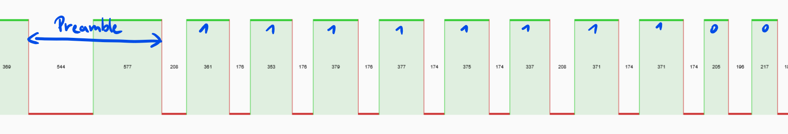

# CrowdLED RE

CrowdLED reverse engineering efforts

## Packets

The packets are sent using 433MHz OOK modulation.



Each packet is 6 bytes long and starts with preamble.

Preamble is ~550us LOW followed by ~550us HIGH.

Each bit is encoded as ~200us LOW followed by

- ~200us HIGH for 0
- ~350us HIGH for 1

```
 0                   1                   2
 0 1 2 3 4 5 6 7 8 9 0 1 2 3 4 5 6 7 8 9 0 1 2 3
+-+-+-+-+-+-+-+-+-+-+-+-+-+-+-+-+-+-+-+-+-+-+-+-+
|                 Unknown                 |     |
+-+-+-+-+-+-+-+-+-+-+-+-+-+-+-+-+-+-+-+-+-+-+-+-+
|        Appears unused         |     CRC8      |
+-+-+-+-+-+-+-+-+-+-+-+-+-+-+-+-+-+-+-+-+-+-+-+-+
```

### CRC8 calculation

CRC8 params were obtained using [RevEng](https://reveng.sourceforge.io/)

```
width=8 poly=0x07 init=0x84 refin=true refout=true xorout=0x00 check=0xcb residue=0x00 name=(none)
```

Correct CRC8 calculation tool: [CRC Calculator (Javascript)](https://www.sunshine2k.de/coding/javascript/crc/crc_js.html)

## Example packets

These packets are confirmed to work with the CrowdLED V3 bracelets with group 22, 23

```
0x5F 0x1C 0x97 0xFF 0x13 - White(ish)
0x5F 0x23 0x97 0xFF 0x13 - Pink
0x5F 0x57 0xFF 0xEF 0x13 - White(ish)
0x03 0x0F 0x19 0xFF 0x13 - Blue blink - only group 22
0x5F 0xC7 0x40 0xFF 0x13 - Salmon
```

## TODO

- [ ] Easier way to test packets (WiFi controlled transmitter?)
- [ ] Figure out color encoding
- [ ] Figure out group encoding
- [ ] Figure out effect encoding

## Credits

- [**MakeTotalSense**](https://github.com/MakeTotalSense/) - [signal recording](https://github.com/MakeTotalSense/Flipper-Concert-bracelets)
- [**Flipper Zero Forum**](https://forum.flipper.net/t/new-device-protocol-crowd-led-and-dmx/6571) - Protocol discussion
